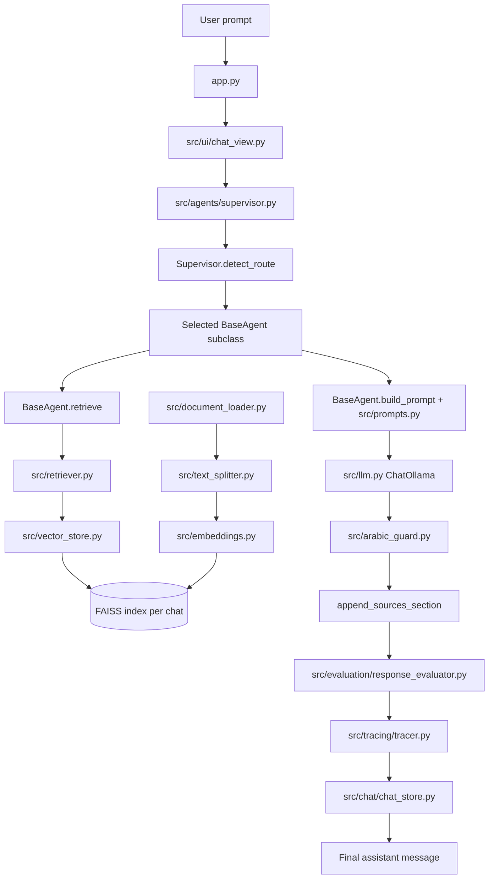
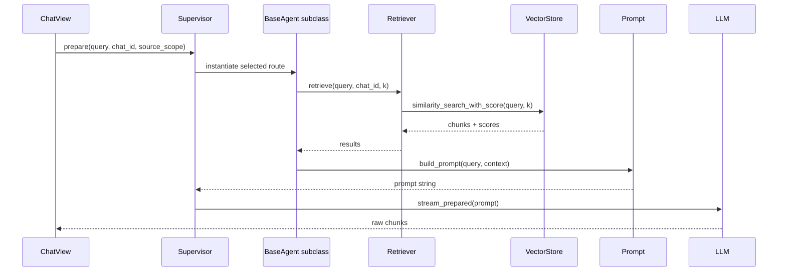
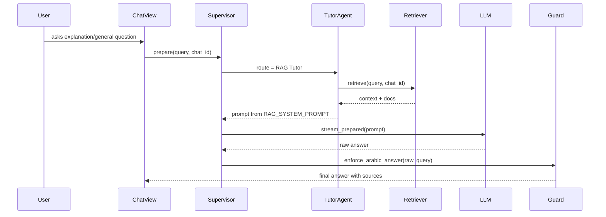
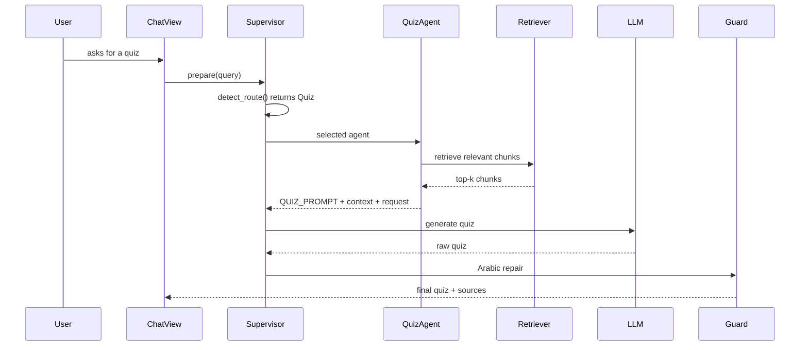
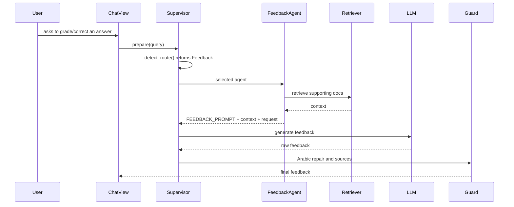
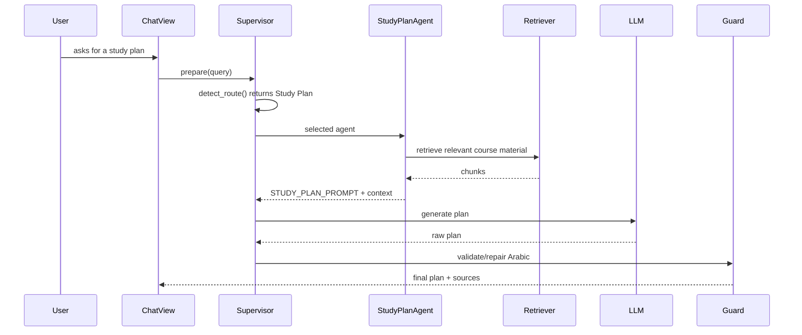
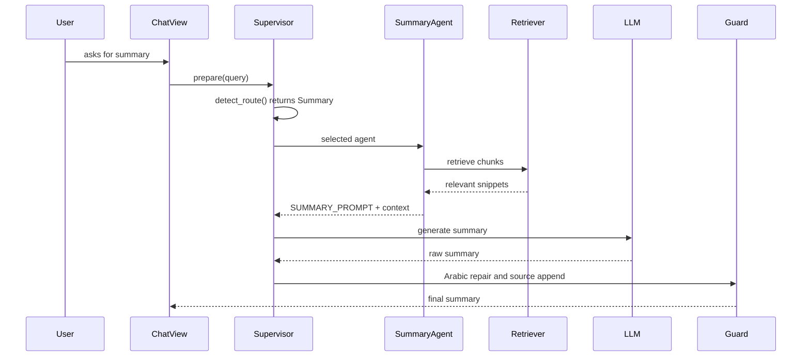
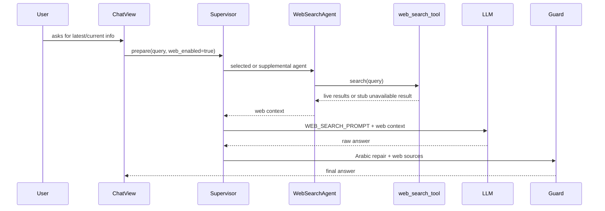
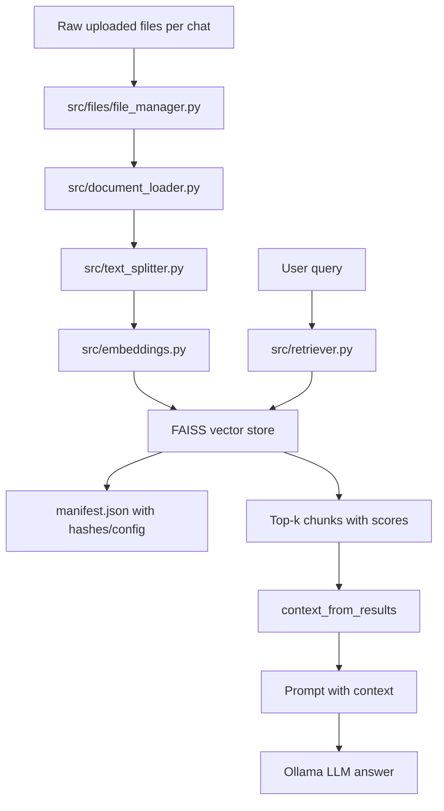

# LLM Project Handover Report

## 1. Executive Summary

This project is an Arabic AI tutor for studying uploaded documents, especially Generative AI, LLM, RAG, prompt engineering, and evaluation material. The LLM backend is a local RAG and agent-orchestration system:

- It is RAG-based because user questions can retrieve chunks from uploaded files stored in a FAISS vector store before the LLM answers.
- It uses agents in `src/agents/`: tutor, quiz, feedback, study-plan, summary, web-search, and calculator route.
- It uses an orchestrator/router: `src/agents/supervisor.py`.
- It has tools: a real safe calculator tool and a web-search abstraction that currently returns an unavailable stub unless a provider is implemented.
- It uses local LLM inference through Ollama via LangChain `ChatOllama`.
- It uses local embeddings through Hugging Face `sentence-transformers/paraphrase-multilingual-MiniLM-L12-v2`.
- Its final purpose is to produce structured Arabic study responses with source references, traces, and evaluation results.

The active runtime flow is not the old `src/rag.py` path. The main application flow goes through `src/ui/chat_view.py`, which creates a `Supervisor`, asks it to prepare the response, streams the LLM output, applies Arabic repair, appends sources, evaluates the answer, and persists trace metadata.

## 2. Scope of This Document

This handover focuses only on:

- LLM pipeline
- orchestration
- agents
- prompts
- retrieval
- vector store
- embeddings
- tools
- response validation
- evaluation
- tracing/observability
- backend connection with `app.py` only where it leads into the LLM flow

This document intentionally does not explain Streamlit layout, CSS, visual styling, sidebar design, buttons, colors, or UI rendering details except when those elements trigger indexing, source-scope selection, or the LLM backend.

## 3. High-Level LLM Architecture



## 4. Complete User Prompt Flow: Caller to Callee

| Step | File | Function | Input | Action | Output | Next Call |
| ---- | ---- | -------- | ----- | ------ | ------ | --------- |
| 1 | `app.py` | `main()` | Streamlit session state | Creates/loads a chat and delegates chat execution | Active chat dict and store object | `render_chat_view(chat, store)` |
| 2 | `src/ui/chat_view.py` | `render_chat_view()` | `chat`, `ChatStore` | Reads `st.chat_input`; saves the user message; creates `Supervisor` and `Tracer` | `query`, `supervisor`, `tracer` | `Supervisor.prepare()` |
| 3 | `src/agents/supervisor.py` | `Supervisor.prepare()` | Query, `chat_id`, source scope, web flag | Normalizes source mode, routes intent, retrieves docs/web if needed, builds prompt or direct tool answer | `PreparedResponse` | `Supervisor.stream_prepared()` |
| 4 | `src/agents/supervisor.py` | `Supervisor.detect_route()` | Query and source settings | Keyword router selects Calculator, Quiz, Feedback, Study Plan, Summary, Web Search, or RAG Tutor | Route string | `_agent_for()` or calculator tool |
| 5 | `src/tools/calculator_tool.py` | `calculation_needed()`, `extract_expression()`, `safe_calculate()` | Query text | If math is detected, extracts and safely evaluates arithmetic | Direct calculator answer | Return to `render_chat_view()` through `PreparedResponse.direct_answer` |
| 6 | `src/agents/supervisor.py` | `_agent_for()` | Route string | Instantiates the selected agent class | `BaseAgent` subclass instance | `agent.retrieve()` |
| 7 | `src/agents/base_agent.py` | `BaseAgent.retrieve()` | Query, `chat_id`, `k` | Calls retrieval unless `use_retrieval=False`; formats context and doc metadata | `context`, `docs` | `retrieve_chunks_with_scores()` |
| 8 | `src/retriever.py` | `retrieve_chunks_with_scores()` | Query, `k`, `chat_id` | Loads/gets FAISS vector store and runs similarity search with score fallback | List of `(Document, score)` | `docs_from_results()` and `context_from_results()` |
| 9 | `src/vector_store.py` | `get_vector_store()` | `chat_id` | Checks manifest/index freshness; rebuilds if missing or dirty; loads FAISS into memory | FAISS store or `None` | FAISS similarity search |
| 10 | `src/vector_store.py` | `rebuild_all()` | `chat_id` | Loads docs, splits chunks, embeds chunks, saves FAISS, writes manifest | `IndexingResult` | `get_vector_store()` |
| 11 | `src/agents/base_agent.py` | `context_from_results()` | Retrieved docs/scores | Formats chunks as numbered context blocks with file, path, location, score, and content | Context string | `BaseAgent.build_prompt()` |
| 12 | `src/agents/base_agent.py` | `docs_from_results()` | Retrieved docs/scores | Builds compact source metadata for traces, citations, and evaluation | List of doc dicts | `PreparedResponse.docs` |
| 13 | `src/agents/base_agent.py` | `BaseAgent.build_prompt()` | Query, context, optional extra | Combines selected prompt template, context, extra instruction, and user request | Final prompt string | `Supervisor.stream_prepared()` |
| 14 | `src/agents/supervisor.py` | `stream_prepared()` | `PreparedResponse` | Streams `direct_answer` or invokes local Ollama model using `llm.stream()` | Raw generated text chunks | `_stream_with_waiting()` |
| 15 | `src/ui/chat_view.py` | `_stream_with_waiting()` | Supervisor and prepared response | Runs streaming in a worker thread, accumulates chunks | Raw answer string | `Supervisor.finalize_answer()` |
| 16 | `src/agents/supervisor.py` | `finalize_answer()` | Raw answer, query, prepared response | Applies Arabic guard and appends file/web/model source section | Final answer | `evaluate_response()` |
| 17 | `src/arabic_guard.py` | `enforce_arabic_answer()` | Raw answer, query, LLM | Detects disallowed scripts/Latin words; asks LLM to rewrite twice; strips as fallback | Arabic-compliant answer | `append_sources_section()` |
| 18 | `src/agents/base_agent.py` | `append_sources_section()` | Guarded answer, docs, web sources | Adds a final source list from retrieved docs and web results | Final answer with sources | `evaluate_response()` |
| 19 | `src/evaluation/response_evaluator.py` | `evaluate_response()` | Query, answer, docs, tools, mode, web sources | Runs deterministic checks, rubric scoring, optional gold standard, optional LLM judge | Evaluation dict | `Tracer.finish()` |
| 20 | `src/tracing/tracer.py` | `Tracer.finish()` | Final answer and evaluation | Stores selected agent, docs, tools, component timings, final answer, evaluation | Trace dict | `ChatStore.append_trace()` |
| 21 | `src/chat/chat_store.py` | `add_message()`, `append_trace()`, `append_evaluation()` | Final answer, docs, trace id, evaluation id | Persists response, trace, evaluation, and stats to JSON chat files | Saved chat state | Streamlit rerun |

Instructor story:

When the user types a prompt, `app.py` does not directly call the LLM. It delegates the active chat to `src/ui/chat_view.py`. Inside `render_chat_view()`, the user prompt is saved, then a `Supervisor` is created. The `Supervisor.prepare()` method is the real control point. It calls `detect_route()` to decide whether the prompt is a quiz, feedback request, study plan, summary, web request, calculator request, or normal RAG tutoring question.

If the query is arithmetic, `Supervisor.prepare()` bypasses the LLM and uses the calculator tool. Otherwise it instantiates the selected agent with `_agent_for()`. For document-backed routes, the agent calls `BaseAgent.retrieve()`, which calls `src/retriever.py`. The retriever gets a FAISS store from `src/vector_store.py`; if the store is missing or stale, `get_vector_store()` may rebuild it by loading files, splitting them, embedding chunks, and saving the index.

The selected agent then builds a prompt from `src/prompts.py` plus retrieved context. `Supervisor.stream_prepared()` sends that prompt to the local Ollama model through `get_llm()`. The raw generated answer goes to `Supervisor.finalize_answer()`, where `enforce_arabic_answer()` repairs non-Arabic output if needed, and `append_sources_section()` adds file/web/model sources. Finally `evaluate_response()` scores the answer, `Tracer` records the route and timings, and `ChatStore` saves the message, trace, and evaluation.

## 5. app.py Connection to LLM Backend

`app.py` is mostly an application entry point. The relevant LLM connection is:

| Function | User Action | Backend Call | Input Sent | Output Expected | Improvement |
| -------- | ----------- | ------------ | ---------- | --------------- | ----------- |
| `main()` in `app.py` | User opens the chat page | `render_chat_view(chat, store)` | Active chat dict and `ChatStore` | Chat view handles prompt submission and LLM backend execution | Make the backend entry explicit by moving AI request handling out of `src/ui/chat_view.py` into a service/controller layer. |

The actual prompt-to-LLM trigger is in `src/ui/chat_view.py`:

| Function | User Action | Backend Call | Input Sent | Output Expected | Improvement |
| -------- | ----------- | ------------ | ---------- | --------------- | ----------- |
| `render_chat_view()` | User submits `st.chat_input()` | `Supervisor.prepare()` | Query, chat id, source scope, web flag | `PreparedResponse` with selected agent, prompt, docs, tools, route | Split UI rendering from AI execution so tests can call the flow without Streamlit. |
| `render_chat_view()` | Prepared response exists | `_stream_with_waiting()` -> `Supervisor.stream_prepared()` | `PreparedResponse` | Raw streamed answer | Add cancellation, timeout, and structured stream events. |
| `render_chat_view()` | Raw model text is complete | `Supervisor.finalize_answer()` | Raw answer, query, prepared response | Arabic-guarded final answer with sources | Add structured output validation before display. |
| `render_chat_view()` | Final answer is ready | `evaluate_response()` | Query, final answer, docs, tools, web sources | Evaluation dict | Move evaluation into an async job for faster user response. |
| `render_chat_view()` | Trace/evaluation complete | `ChatStore.append_trace()`, `append_evaluation()`, `add_message()` | Trace, evaluation, assistant answer | Saved JSON chat record | Add token usage, model name, prompt hash, retrieval params. |

## 6. Orchestrator Explanation

The orchestrator is `src/agents/supervisor.py`. There is also `src/orchestrator.py`, but it only re-exports `detect_intent` from `src/intent_detector.py`; it is not the active runtime orchestrator.

Responsibility:

- Route user queries to the correct agent or tool.
- Retrieve document and/or web context before prompting.
- Build a `PreparedResponse` object that contains route, prompt, sources, tools, direct answer, and timings.
- Stream model output.
- Apply Arabic validation/repair and append sources.

Why it exists:

Without `Supervisor`, every UI path would need to know which agent to call, when to retrieve documents, how to use tools, and how to post-process answers. `Supervisor` centralizes that decision-making.

### Function: `PreparedResponse`

- File: `src/agents/supervisor.py`
- Purpose: Dataclass carrying the prepared work for one prompt.
- Called by: `Supervisor.prepare()`
- Calls: None
- Input: selected agent name, route, prompt, docs, tools, web sources, optional direct answer, timings
- Output: A structured object consumed by streaming, finalization, tracing, and evaluation
- Step-by-step logic: Stores fields only; no behavior.
- Example: `PreparedResponse(selected_agent="Quiz", route=["Supervisor","Quiz"], prompt="...", docs=[...])`
- Failure cases: None directly, but missing prompt with no `direct_answer` would fail downstream.
- Improvement suggestions: Add `model_name`, `temperature`, `retrieval_k`, `prompt_version`, and `source_scope`.

### Function: `Supervisor.detect_route()`

- File: `src/agents/supervisor.py`
- Purpose: Keyword-based intent router.
- Called by: `Supervisor.prepare()` and `src/intent_detector.py.detect_intent()`.
- Calls: `calculation_needed()` from `src/tools/calculator_tool.py`.
- Input: query, source scope, web enabled flag.
- Output: One route string: `Calculator`, `Quiz`, `Feedback`, `Study Plan`, `Summary`, `Web Search`, or `RAG Tutor`.
- Step-by-step logic:
  1. Lowercases the query.
  2. Checks math indicators first.
  3. Checks quiz keywords.
  4. Checks feedback/evaluation keywords.
  5. Checks study-plan keywords.
  6. Checks summary keywords.
  7. Routes to web search if source scope is `Web only` or web is enabled and the query looks current/web-related.
  8. Defaults to `RAG Tutor`.
- Example: `Generate 5 MCQs from my notes` returns `Quiz`.
- Failure cases: Ambiguous prompts can be misrouted; multilingual keyword coverage is limited; intent priority is hard-coded.
- Improvement suggestions: Replace with an LLM/classifier router that returns a typed enum plus confidence and rationale.

### Function: `Supervisor._agent_for()`

- File: `src/agents/supervisor.py`
- Purpose: Map a route string to an agent class instance.
- Called by: `Supervisor.prepare()`.
- Calls: Agent constructors for `QuizAgent`, `FeedbackAgent`, `StudyPlanAgent`, `SummaryAgent`, `WebSearchAgent`, or `TutorAgent`.
- Input: Route string.
- Output: Agent instance.
- Step-by-step logic: Looks up the route in a dictionary and defaults to `TutorAgent`.
- Example: `_agent_for("Study Plan")` returns `StudyPlanAgent()`.
- Failure cases: Route typos silently become `TutorAgent`.
- Improvement suggestions: Use an enum and raise a controlled error for unknown routes.

### Function: `Supervisor._direct_answer()`

- File: `src/agents/supervisor.py`
- Purpose: Build a structured direct response for tool-only or no-index cases.
- Called by: `Supervisor.prepare()`.
- Calls: None.
- Input: Body text and source label.
- Output: Markdown answer with short answer, detail, example, sources, and study summary.
- Step-by-step logic: Injects the body and source label into a fixed Arabic answer structure.
- Example: Calculator answer uses source label for calculator tool.
- Failure cases: Static structure may not fit every direct answer.
- Improvement suggestions: Keep the response template in `src/prompts.py` or a `prompts/direct_answer.md` file.

### Function: `Supervisor.prepare()`

- File: `src/agents/supervisor.py`
- Purpose: Prepare the route, context, prompt, sources, tools, and timings before generation.
- Called by: `src/ui/chat_view.py.render_chat_view()`.
- Calls: `detect_route()`, calculator functions, `_agent_for()`, `agent.retrieve()`, `WebSearchAgent.search()`, `agent.build_prompt()`.
- Input: query, chat id, source scope, web enabled flag.
- Output: `PreparedResponse`.
- Step-by-step logic:
  1. Normalizes source scope against `SOURCE_SCOPES`.
  2. Detects selected route.
  3. Handles calculator as a direct-answer path.
  4. Instantiates selected agent.
  5. Retrieves document context for document-backed source modes unless selected agent is web search.
  6. If documents-only mode has no docs, returns a direct no-index answer.
  7. Performs web search if source mode allows web and web is enabled.
  8. Combines document context and web context.
  9. Builds the final prompt with the agent.
  10. Returns `PreparedResponse`.
- Example: For `Explain RAG from my PDF`, it routes to `RAG Tutor`, retrieves top-k chunks, builds `RAG_SYSTEM_PROMPT + context + user request`.
- Failure cases: Rebuild may occur synchronously during retrieval; missing docs returns direct answer; web search is currently a stub; retrieval errors can collapse to no docs.
- Improvement suggestions: Separate routing, retrieval, tool use, and prompt construction into independent services with explicit error objects.

### Function: `Supervisor.stream_prepared()`

- File: `src/agents/supervisor.py`
- Purpose: Stream a prepared answer from either direct-answer path or local LLM.
- Called by: `src/ui/chat_view.py._stream_with_waiting()`.
- Calls: `get_llm()`, `llm.stream()`, fallback `llm.invoke()`.
- Input: `PreparedResponse`.
- Output: Generator yielding text chunks.
- Step-by-step logic:
  1. If `direct_answer` exists, yields it and stops.
  2. Creates local Ollama chat model.
  3. Uses streaming if the LangChain object supports it.
  4. Otherwise invokes synchronously and yields 28-character chunks.
- Example: A quiz prompt streams quiz sections as chunks.
- Failure cases: Ollama unavailable, model missing, stream failure, no timeout.
- Improvement suggestions: Add retry, timeout, model availability check, structured stream events, and token usage metrics.

### Function: `Supervisor.finalize_answer()`

- File: `src/agents/supervisor.py`
- Purpose: Post-process raw model output.
- Called by: `src/ui/chat_view.py.render_chat_view()`.
- Calls: `get_llm()`, `enforce_arabic_answer()`, `append_sources_section()`.
- Input: raw answer, query, `PreparedResponse`.
- Output: Final answer string.
- Step-by-step logic:
  1. If this was a direct-answer path, returns raw answer unchanged.
  2. Creates local LLM for Arabic repair.
  3. Runs `enforce_arabic_answer()`.
  4. Appends file and web source section.
- Example: Raw English-heavy explanation becomes an Arabic answer with source list appended.
- Failure cases: Repair LLM can change content; source section can duplicate prompt-requested source headings; no structured citation checking.
- Improvement suggestions: Use structured validation with JSON schema, citation IDs, and a separate faithfulness checker.

## 7. Agent-by-Agent Explanation

All document-backed agents inherit from `BaseAgent` in `src/agents/base_agent.py`. Their current design is intentionally simple: each agent mostly selects a prompt template and uses inherited retrieval, prompt building, and LLM invocation.

### Shared Agent Base

#### Role

`BaseAgent` is the reusable agent implementation. It knows how to retrieve chunks, format retrieval context, build the final prompt, and invoke the LLM.

#### File

`src/agents/base_agent.py`

#### Internal Flow



#### Functions

- `source_location(metadata)`: Reads page and line metadata and returns a human-readable location string.
- `_source_name(source)`: Converts a source path into a file name.
- `docs_from_results(results)`: Converts retrieved chunks into source dictionaries for traces, citations, and evaluation.
- `context_from_results(results)`: Converts retrieved chunks into LLM context blocks.
- `append_sources_section(answer, docs, web_sources)`: Adds a final source list to the answer.
- `BaseAgent.retrieve(query, chat_id, k)`: Calls `retrieve_chunks_with_scores()` and returns context plus source docs.
- `BaseAgent.build_prompt(query, context, extra)`: Combines the agent prompt, context, optional extra instruction, and user request.
- `BaseAgent.invoke(prompt)`: Synchronous `get_llm().invoke(prompt).content` helper used by legacy function wrappers.

Edge cases:

- If no vector store exists, retrieval returns empty context and empty docs.
- If a document lacks page/line metadata, the source location becomes unavailable.
- Similarity scores from FAISS are passed through without normalization or explanation.

Improvements:

- Add citation IDs like `[doc-1]` and require the LLM to cite them.
- Add context length limits and chunk deduplication.
- Add a reranker before formatting context.
- Make `build_prompt()` return a structured prompt object with prompt version metadata.

### Tutor Agent

#### Role

The Tutor Agent answers general study questions using uploaded document context when available. It is the default RAG path.

#### File

`src/agents/tutor_agent.py`

#### When It Is Called

It is called when `Supervisor.detect_route()` does not match calculator, quiz, feedback, study plan, summary, or web search. The selected route is `RAG Tutor`.

#### Internal Flow



#### Functions

`TutorAgent` class:

- Purpose: Sets `name = "RAG Tutor"` and `prompt = RAG_SYSTEM_PROMPT`.
- Input: Inherited methods receive query and context.
- Output: Prompted response as Arabic tutor answer.
- Caller: `Supervisor._agent_for()`.
- Callees: Inherited `BaseAgent.retrieve()` and `BaseAgent.build_prompt()`.
- Edge cases: All behavior depends on shared base implementation.
- Improve: Add tutor-specific behavior such as concept extraction, prerequisite checking, and response style levels.

`tutor_agent(query, chat_id)`:

- Purpose: Legacy/direct wrapper for synchronous tutor generation.
- Input: query and optional chat id.
- Output: dict with `answer`, `docs`, `confidence`, `tools_used`.
- Caller: Tests or old code paths; current chat flow uses `Supervisor`.
- Callees: `TutorAgent.retrieve()`, `build_prompt()`, `invoke()`.
- Example input: `What is RAG?`
- Example output: `{"answer": "...", "docs": [...], "tools_used": []}`
- Edge cases: Does not apply `enforce_arabic_answer()` or append sources itself.
- Improve: Either remove it or align it with `Supervisor.finalize_answer()`.

### Quiz Agent

#### Role

The Quiz Agent generates quizzes from retrieved context.

#### File

`src/agents/quiz_agent.py`

#### When It Is Called

It is called when query text contains keywords like `quiz`, `mcq`, `test`, or Arabic equivalents.

#### Internal Flow



#### Functions

`QuizAgent` class:

- Purpose: Sets `name = "Quiz"` and `prompt = QUIZ_PROMPT`.
- Input: Query and retrieval context through inherited methods.
- Output: Quiz prompt and model output.
- Caller: `Supervisor._agent_for()`.
- Callees: `BaseAgent.retrieve()`, `BaseAgent.build_prompt()`.
- Edge cases: Does not enforce exact question count itself.
- Improve: Use structured output with question objects, choices, answer key, source id, difficulty.

`quiz_agent(query, chat_id)`:

- Purpose: Legacy wrapper that adds extra instruction: generate 5 questions unless user asks for a number.
- Input: query and chat id.
- Output: dict with quiz answer and docs.
- Caller: Old tests/import path; not active in streaming chat flow.
- Callees: `retrieve()`, `build_prompt(..., extra)`, `invoke()`.
- Example input: `Make a 5-question quiz about RAG.`
- Example output: Markdown quiz with target, questions, answer table, review advice.
- Edge cases: The active `Supervisor.prepare()` does not pass the same extra instruction, so behavior differs from this wrapper.
- Improve: Move the "5 questions by default" rule into `QUIZ_PROMPT` or a quiz-specific `build_prompt()`.

### Feedback Agent

#### Role

The Feedback Agent evaluates or corrects a student's answer using retrieved source context.

#### File

`src/agents/feedback_agent.py`

#### When It Is Called

It is called when query text contains feedback/evaluation/correction keywords.

#### Internal Flow



#### Functions

`FeedbackAgent` class:

- Purpose: Sets feedback prompt.
- Input: User answer/request and retrieved context.
- Output: Structured feedback.
- Caller: `Supervisor._agent_for()`.
- Callees: inherited base methods.
- Edge cases: User answer and grading rubric are not parsed into structured fields.
- Improve: Split student answer, question, rubric, and source context into separate prompt variables.

`feedback_agent(query, chat_id)`:

- Purpose: Legacy synchronous wrapper.
- Input: query and chat id.
- Output: dict with answer/docs.
- Caller: Old imports.
- Callees: `retrieve()`, `build_prompt()`, `invoke()`.
- Example input: `Evaluate my answer: RAG is...`
- Example output: Markdown grading feedback.
- Edge cases: No Arabic guard or final source appending in wrapper.
- Improve: Delegate to `Supervisor` or remove.

### Study Plan Agent

#### Role

The Study Plan Agent creates a study roadmap, exercises, short quiz, and progress plan.

#### File

`src/agents/study_plan_agent.py`

#### When It Is Called

It is called when the query contains `plan`, `schedule`, `roadmap`, or Arabic study-plan keywords.

#### Internal Flow



#### Functions

`StudyPlanAgent` class:

- Purpose: Selects `STUDY_PLAN_PROMPT`.
- Input: Goal/time request plus context.
- Output: Markdown study plan.
- Caller: `Supervisor._agent_for()`.
- Callees: inherited base methods.
- Edge cases: Does not parse deadline, available hours, skill level, or topic list.
- Improve: Create a planning schema with fields for timeframe, topics, sessions, tasks, assessments.

`study_plan_agent(query, chat_id)`:

- Purpose: Legacy synchronous wrapper.
- Input: query and chat id.
- Output: dict with answer/docs.
- Caller: Old imports.
- Callees: `retrieve()`, `build_prompt()`, `invoke()`.
- Example input: `Make a 7-day study plan for RAG.`
- Edge cases: No validation of schedule feasibility.
- Improve: Add a calendar-aware planning tool.

### Summary Agent

#### Role

The Summary Agent summarizes retrieved material.

#### File

`src/agents/summary_agent.py`

#### When It Is Called

It is called when the query contains `summary`, `summarize`, or Arabic summary keywords.

#### Internal Flow



#### Functions

`SummaryAgent` class:

- Purpose: Selects `SUMMARY_PROMPT`.
- Input: Summary request and retrieved context.
- Output: Structured Arabic summary.
- Caller: `Supervisor._agent_for()`.
- Callees: inherited base methods.
- Edge cases: Summarizes only top-k retrieved chunks, not the whole document.
- Improve: Add map-reduce or hierarchical summarization for full-document summaries.

`summary_agent(query, chat_id)`:

- Purpose: Legacy synchronous wrapper.
- Input: query and chat id.
- Output: dict with summary/docs.
- Caller: Old imports.
- Callees: `retrieve()`, `build_prompt()`, `invoke()`.
- Improve: Match active `Supervisor` post-processing.

### Web Search Agent

#### Role

The Web Search Agent is designed to answer using web results instead of uploaded documents.

#### File

`src/agents/web_search_agent.py`

#### When It Is Called

It is called when source scope is `Web only`, or when web is enabled and the query contains current/web keywords.

#### Internal Flow



#### Functions

`WebSearchAgent.search(query)`:

- Purpose: Calls `web_search()` and catches `WebSearchUnavailable`.
- Input: query.
- Output: list of web source dicts.
- Caller: `Supervisor.prepare()` and `web_search_agent()`.
- Callees: `web_search()` and `stub_result()`.
- Edge cases: No live provider exists, so most calls return a stub message.
- Improve: Implement Tavily, SerpAPI, Bing, or Brave provider adapter with retries and source quality filtering.

`web_search_agent(query)`:

- Purpose: Legacy synchronous web answer wrapper.
- Input: query.
- Output: dict with answer, web sources, and `tools_used=["web_search"]`.
- Caller: Old imports.
- Callees: `WebSearchAgent.search()`, `build_prompt()`, `invoke()`.
- Edge cases: No Arabic guard in wrapper.
- Improve: Use the same finalization flow as `Supervisor`.

## 8. Retrieval and Vector Store Pipeline



### Where Documents Are Loaded

- Uploaded files are saved by `src/files/file_manager.py.save_uploaded_files()` into `data/raw_docs/chat_<chat_id>/`.
- `src/document_loader.py.load_documents(chat_id)` loads files from that chat-specific directory.
- `load_file()` supports `.pdf`, `.txt`, `.md`, `.csv`, and `.docx`.
- PDF loading uses `PyPDFLoader`; CSV uses `CSVLoader` when available; DOCX uses `Docx2txtLoader` or `python-docx`; text uses `TextLoader` with encoding fallbacks.

### Where Chunks Are Created

- `src/text_splitter.py.split_documents()` uses LangChain `RecursiveCharacterTextSplitter`.
- Chunk configuration comes from `src/config.py`:
  - `CHUNK_SIZE` defaults to `1000`.
  - `CHUNK_OVERLAP` defaults to `200`.
- Separators include paragraph breaks, lines, sentence punctuation, Arabic punctuation, spaces, and character fallback.

### Where Embeddings Are Created

- `src/embeddings.py.get_embedding_model()` returns `HuggingFaceEmbeddings`.
- Model name comes from `EMBEDDING_MODEL_NAME` in `src/config.py`.
- Default embedding model: `sentence-transformers/paraphrase-multilingual-MiniLM-L12-v2`.

### Where FAISS Is Stored

- Global fallback index: `vector_store/faiss_index/`.
- Chat-specific index: `vector_store/chat_<chat_id>/faiss_index/`.
- Required files: `index.faiss` and `index.pkl`.
- Chat manifest: `vector_store/chat_<chat_id>/manifest.json`.

### How Retrieval Works

1. `BaseAgent.retrieve()` calls `src/retriever.py.retrieve_chunks_with_scores()`.
2. `retrieve_chunks_with_scores()` calls `get_vector_store(chat_id)`.
3. `get_vector_store()` calls `analyze_index_changes()` to decide whether to rebuild.
4. If needed, `rebuild_all()` loads docs, splits, embeds, saves FAISS, and writes the manifest.
5. Retrieval uses `vector_store.similarity_search_with_score(query=query, k=k)`.
6. If score search fails, it falls back to `similarity_search()` and returns scores as `None`.

### How Top-K Is Selected

- `TOP_K` is configured in `src/config.py`, defaulting to `4`.
- `BaseAgent.retrieve()` passes `k=TOP_K` unless overridden.
- There is no dynamic top-k, thresholding, reranking, or query expansion yet.

### How Retrieved Chunks Are Formatted

- `context_from_results()` formats each chunk as:
  - numbered chunk
  - file name
  - path
  - page/line location if metadata exists
  - similarity score
  - instruction to explain in Arabic
  - raw chunk content

- `docs_from_results()` creates source dictionaries with:
  - rank
  - title
  - source path
  - source name
  - page/line
  - score
  - first 700 characters as snippet

### How Sources Are Passed to the LLM

The full source text is passed through the prompt context. Source metadata is also carried separately in `PreparedResponse.docs`. After generation, `append_sources_section()` appends the source list to the final answer. Evaluation also receives the same `docs`.

### Retrieval Functions

| File | Function | Role | Notes |
| ---- | -------- | ---- | ----- |
| `src/files/file_manager.py` | `save_uploaded_files()` | Saves uploaded files into chat-specific raw docs directory | Marks chat as files uploaded. |
| `src/document_loader.py` | `load_documents()` | Loads all supported documents for a chat | Adds load-error documents if a file fails. |
| `src/document_loader.py` | `load_file()` | Loads one file based on extension | Adds metadata: source, file name, file type. |
| `src/text_splitter.py` | `split_documents()` | Chunks loaded documents | Uses recursive character splitting. |
| `src/embeddings.py` | `get_embedding_model()` | Creates embedding model | No cache at this layer. |
| `src/vector_store.py` | `create_vector_store()` | Creates FAISS from chunks | Returns `None` if chunks are empty. |
| `src/vector_store.py` | `save_vector_store()` | Persists FAISS index | Writes to per-chat index path. |
| `src/vector_store.py` | `load_vector_store()` | Loads FAISS index | Uses `allow_dangerous_deserialization=True`. |
| `src/vector_store.py` | `analyze_index_changes()` | Detects stale/missing index | Compares file hashes and config. |
| `src/vector_store.py` | `rebuild_all()` | Full indexing pipeline | Deletes old index, rebuilds all chunks. |
| `src/vector_store.py` | `get_vector_store()` | Retrieves or rebuilds in-memory FAISS | Can rebuild during user query. |
| `src/retriever.py` | `retrieve_chunks_with_scores()` | Runs query-time similarity search | Returns chunks with scores. |

## 9. Prompt Engineering Layer

All prompt templates are in `src/prompts.py`.

| Prompt Variable | File | Purpose | Input Variables | Output Expectation | Strengths | Weaknesses | Recommended Improvements |
| --------------- | ---- | ------- | --------------- | ------------------ | --------- | ---------- | ------------------------ |
| `ARABIC_OUTPUT_RULES` | `src/prompts.py` | Enforce simplified Modern Standard Arabic and allow only necessary technical English terms | Injected into agent prompts | Arabic answer with limited English technical terms | Central reusable language policy | Not machine-validated until after generation | Use same allowed terms list as `arabic_guard.py` from one config source. |
| `SOURCE_RULES` | `src/prompts.py` | Prevent invented sources and require source classification | Injected into agent prompts | Sources labeled as files, web, model, or teaching example | Good anti-hallucination instruction | Does not force citation IDs per claim | Require source IDs and run citation checker. |
| `STUDY_WITH_ME_STRUCTURE` | `src/prompts.py` | Forces tutor answer sections | Used in RAG/tutor prompts | Short answer, detailed explanation, example, sources, study summary | Clear learning format | One rigid structure for all questions | Make structure adaptive by intent and length request. |
| `RAG_SYSTEM_PROMPT` | `src/prompts.py` | Main tutor prompt | Context and user request via `BaseAgent.build_prompt()` | Arabic study answer grounded in retrieval | Strong default RAG behavior | No explicit refusal format when context is weak | Add answerability classification before answering. |
| `TUTOR_PROMPT` | `src/prompts.py` | General tutor prompt | Currently not used by active agents | Arabic tutor answer | Useful fallback | Dead/unused in current code | Remove or wire to a non-RAG tutor. |
| `QUIZ_PROMPT` | `src/prompts.py` | Quiz generation | Context and user request | Quiz goal, questions, answer table, review advice | Good output skeleton | Active flow lacks explicit default count instruction | Add structured JSON schema then render Markdown. |
| `FEEDBACK_PROMPT` | `src/prompts.py` | Student answer evaluation | Context and user request | Score, correct parts, fixes, improved answer, evidence | Good educational feedback structure | Student answer is not separated from instruction | Parse fields before prompt. |
| `STUDY_PLAN_PROMPT` | `src/prompts.py` | Study roadmap generation | Context and user request | Goal, plan, exercises, quiz, sources, progress | Useful for planning | No feasibility validation | Add duration, level, constraints, and calendar fields. |
| `SUMMARY_PROMPT` | `src/prompts.py` | Summarization | Context and user request | Summary, key ideas, details, example, sources, review points | Clear summary structure | Only summarizes retrieved top-k chunks | Add full-document summarization path. |
| `WEB_SEARCH_PROMPT` | `src/prompts.py` | Web-based research answers | Web context and user request | Arabic answer citing web separately | Separates web from files | Web provider missing | Implement provider and freshness metadata. |
| `VERIFIER_PROMPT` | `src/prompts.py` | Grounding verifier | Answer and context, if wired | Supported/partially/unsupported labels | Good idea | Currently unused | Integrate into finalization/evaluation. |

Prompt controls:

- Arabic answer: `ARABIC_OUTPUT_RULES` plus `enforce_arabic_answer()`.
- No hallucination: `SOURCE_RULES`, RAG prompt rules, and source-grounding evaluation.
- Source usage: context blocks include file/path/location/score; final answer appends source list.
- Quiz generation: `QUIZ_PROMPT` defines quiz structure.
- Study plan generation: `STUDY_PLAN_PROMPT` defines plan sections.
- Feedback: `FEEDBACK_PROMPT` defines grading sections.
- Formatting: every prompt uses Markdown headings.

## 10. LLM Configuration

| Item | Current Value |
| ---- | ------------- |
| LLM provider | Local Ollama |
| LangChain class | `ChatOllama` |
| Configuration file | `src/config.py` |
| Invocation file | `src/llm.py` |
| Default model | `qwen:7b` from `OLLAMA_MODEL` env var |
| Default temperature | `0.3` in `get_llm()` |
| Evaluator model | `EVALUATOR_OLLAMA_MODEL` or default model |
| Evaluator temperature | `EVALUATOR_LLM_TEMPERATURE`, default `0` |
| Max tokens | Not configured |
| Top-k/top-p | Not configured for LLM generation |
| Streaming | Yes, if `llm.stream()` exists |
| Synchronous fallback | Yes, `llm.invoke()` then chunks the text manually |

Main functions:

- `get_llm(temperature=0.3, model=None)`: Creates a local `ChatOllama`.
- `get_evaluator_llm()`: Creates the judge model using evaluator config.
- `stream_llm(prompt, temperature=0.3)`: Generic streaming helper. Note: active chat flow uses `Supervisor.stream_prepared()` instead.

Risks and limitations:

- No model availability check before user asks a question.
- No max token limit, context budget, or truncation policy.
- No model-specific prompt formatting.
- No token usage collection.
- LLM generation and repair both use local model calls, which can double latency.
- Evaluation can call the same LLM as judge, which risks self-evaluation bias.

## 11. Output Validation / Arabic Guard / Repair Logic

File: `src/arabic_guard.py`

Purpose:

The Arabic guard checks whether generated output contains disallowed scripts or unapproved Latin words. If it does, it asks the LLM to rewrite the answer in Arabic while preserving meaning and structure. If repair still fails after two attempts, it strips disallowed language with regex.

Functions:

| Function | What It Checks or Does |
| -------- | ---------------------- |
| `_is_allowed_latin_word(word)` | Allows configured technical terms, all-uppercase acronyms of length 2-12, and short alphanumeric tokens. |
| `contains_disallowed_language(text)` | Rejects Cyrillic, Hebrew, Japanese, Chinese, Korean scripts, and Latin words not allowed by `_is_allowed_latin_word()`. |
| `strip_disallowed_language(text)` | Removes disallowed scripts and replaces disallowed Latin words with spaces. |
| `enforce_arabic_answer(answer, query, llm)` | Runs detection; if needed, asks the LLM to rewrite up to two times; then falls back to stripping. |

Allowed examples:

- `RAG`
- `LLM`
- `Transformer`
- `FAISS`
- uppercase acronyms
- short tokens with digits such as model names

Rejected examples:

- Long English sentences copied from retrieved documents.
- Non-Arabic scripts outside the allow list.
- Unapproved Latin words that are not technical terms.

Before/after example:

| Stage | Example |
| ----- | ------- |
| Before | `RAG retrieves relevant context before generation and reduces hallucination.` |
| Repair goal | Arabic explanation that keeps only necessary terms like `RAG` and `LLM`. |
| After | Arabic answer explaining that RAG retrieves context before generation and helps reduce hallucination. |

Fallback behavior:

If two LLM repair attempts still contain disallowed language, `strip_disallowed_language()` removes disallowed text. This is safe for language policy but risky for answer quality because it can delete important content.

Improvement suggestions:

- Use one shared allowed-term config for prompts, guard, and evaluation.
- Add tests for Arabic ratio, allowed terms, and mixed-language technical examples.
- Return validation metadata, not only repaired text.
- Validate headings and citation IDs in the same pass.

## 12. Tools and Agent Capabilities

Current tools:

| Tool | File | Purpose | Input | Output | Called By | Risks | Improvement Ideas |
| ---- | ---- | ------- | ----- | ------ | --------- | ----- | ----------------- |
| Calculator | `src/tools/calculator_tool.py` | Safely evaluate numeric arithmetic | Query text or extracted expression | `CalculatorResult(expression, result)` | `Supervisor.detect_route()` and `Supervisor.prepare()` | Regex is conservative but expression extraction can misread text | Add unit tests for edge cases, percentages, division by zero, Arabic numerals. |
| Web search | `src/tools/web_search_tool.py` | Abstract live web search | Query and max results | List of `WebSearchResult` dicts or unavailable stub | `WebSearchAgent.search()` and `Supervisor.prepare()` | No live provider implemented; answers may cite only stub result | Implement provider adapters, source freshness, domain allow/block lists. |

Current capabilities:

- Document search through FAISS retrieval is implemented as agent base behavior, not as an explicit tool object.
- Calculator is a true tool route that bypasses the LLM.
- Web search is architected as a tool but currently unavailable by default.

Professional tool architecture to add:

| Proposed Tool | Purpose |
| ------------- | ------- |
| `document_search_tool` | Explicit retriever tool returning citation-ready chunks. |
| `quiz_generation_tool` | Generates structured quiz JSON validated by schema. |
| `answer_grading_tool` | Grades student answer against rubric and source facts. |
| `study_plan_generator` | Builds feasible plans from topic graph, time, and level. |
| `citation_checker` | Verifies each claim points to a retrieved source. |
| `hallucination_checker` | Flags unsupported claims before final answer. |
| `concept_extractor` | Extracts key concepts from documents for tutoring paths. |
| `summarization_tool` | Supports map-reduce document summaries. |
| `flashcard_generator` | Creates spaced-repetition cards from chunks. |
| `evaluation_tool` | Runs retrieval and answer quality benchmarks. |

## 13. Evaluation System

Existing evaluation code is in `src/evaluation/`.

Active evaluation flow:

1. `render_chat_view()` calls `evaluate_response()` after final answer creation.
2. `evaluate_response()` runs deterministic checks from `code_evaluators.py`.
3. It creates a rubric score using `RUBRIC_STANDARDS`.
4. It optionally grades against gold standards from `data/evaluations/gold_standards.json`.
5. It optionally calls an LLM judge in `same LLM` or `evaluator LLM` mode.
6. It returns an `EvaluationResult` dict and stores it with the chat.

Existing deterministic checks:

- `check_arabic_language()`
- `check_required_structure()`
- `check_source_grounding()`
- `check_line_count()`
- `check_word_count()`
- `check_quiz_count()`
- calculator tool trace check

| Evaluation Type | What It Measures | How To Implement | Priority |
| --------------- | ---------------- | ---------------- | -------- |
| Retrieval recall | Whether expected source chunks are retrieved | Build query-source gold set; measure recall@k and MRR | High |
| Retrieval precision | Whether retrieved chunks are relevant | Human labels or LLM-assisted relevance judging | High |
| Answer faithfulness | Whether claims are supported by retrieved chunks | Use `VERIFIER_PROMPT` plus citation-level checks | High |
| Citation correctness | Whether source references actually support claims | Require citation IDs and verify against snippets | High |
| Arabic quality | Arabic ratio, allowed terms, clarity | Extend `check_arabic_language()` with grammar/style rubric | High |
| Hallucination rate | Unsupported claims per answer | Compare answer claims to retrieved chunks | High |
| Quiz correctness | Whether questions/answers are correct and sourced | Structured quiz schema plus answer checker | Medium |
| Study plan quality | Feasibility and coverage | Parse plan into sessions and compare to requested constraints | Medium |
| Latency | Time by route, retrieval, LLM, repair, evaluation | Already partially traced; add dashboards | Medium |
| Token usage | Prompt/completion usage | Add model callback/token estimator | Medium |
| User feedback score | Human satisfaction | Store thumbs up/down plus comments | Medium |
| Regression tests | Prevent prompt and routing regressions | Golden prompts with expected route and checks | High |

## 14. End-to-End Example Walkthroughs

### Example 1: Explanation Question

- Input prompt: `Explain what RAG means from my uploaded PDF.`
- Routed intent: `RAG Tutor`
- Selected agent: `TutorAgent`
- Key files/functions:
  - `render_chat_view()` receives the query.
  - `Supervisor.prepare()` calls `detect_route()`.
  - `detect_route()` falls through to `RAG Tutor`.
  - `_agent_for()` returns `TutorAgent()`.
  - `TutorAgent.retrieve()` calls `retrieve_chunks_with_scores()`.
  - `BaseAgent.build_prompt()` uses `RAG_SYSTEM_PROMPT`.
  - `stream_prepared()` streams from `ChatOllama`.
  - `finalize_answer()` applies `enforce_arabic_answer()` and `append_sources_section()`.
- Retrieved chunks: top 4 by default from FAISS, each formatted with file name, path, location, similarity score, and content.
- Final prompt shape:

```text
RAG_SYSTEM_PROMPT

CONTEXT:
[chunk 1]
File: ...
Location: ...
Similarity score: ...
Content: ...

USER REQUEST:
Explain what RAG means from my uploaded PDF.
```

- LLM output: Arabic structured explanation.
- Validation: Arabic guard checks disallowed language and repairs if needed.
- Final response: Answer plus appended source list.

### Example 2: Quiz Request

- Input prompt: `Create a 5-question quiz about retrieval augmented generation.`
- Routed intent: `Quiz`
- Selected agent: `QuizAgent`
- Flow:
  1. `detect_route()` sees `quiz`.
  2. `Supervisor.prepare()` instantiates `QuizAgent`.
  3. `QuizAgent.retrieve()` retrieves top-k context.
  4. `build_prompt()` uses `QUIZ_PROMPT`.
  5. LLM generates quiz sections.
  6. Arabic guard repairs language.
  7. `evaluate_response()` checks quiz structure and question count.
- Weakness: Active `Supervisor` path does not pass the legacy wrapper's "Generate 5 questions unless the user asks..." extra instruction. Put this rule into `QUIZ_PROMPT`.

### Example 3: Study Plan Request

- Input prompt: `Make a 7-day study plan for the uploaded RAG paper.`
- Routed intent: `Study Plan`
- Selected agent: `StudyPlanAgent`
- Flow:
  1. `detect_route()` sees `plan`.
  2. `StudyPlanAgent` retrieves context.
  3. `STUDY_PLAN_PROMPT` asks for goal, plan, exercises, short quiz, sources, progress tracking.
  4. LLM streams a plan.
  5. Arabic guard and source appending run.
  6. Evaluation checks plan structure and source grounding.
- Weakness: The plan is not guaranteed to be feasible because days, hours, level, and prerequisites are not structured.

### Example 4: Question With Missing Context

- Input prompt: `Explain the uploaded document.`
- Source scope: `Documents only`
- Condition: No indexed docs exist for the chat.
- Flow:
  1. `Supervisor.prepare()` routes to `RAG Tutor`.
  2. `agent.retrieve()` returns no docs.
  3. Because source scope is `Documents only`, `Supervisor.prepare()` returns `PreparedResponse.direct_answer`.
  4. `stream_prepared()` yields the direct answer without calling the LLM.
  5. `finalize_answer()` returns direct answer unchanged.
- Final response: Tells the user that no indexed documents exist and asks them to upload/build the index.

## 15. Function Reference Table

| File | Function/Class | Purpose | Called By | Calls | Input | Output | Importance |
| ---- | -------------- | ------- | --------- | ----- | ----- | ------ | ---------- |
| `app.py` | `main()` | Entry point that delegates chat page | Streamlit runtime | `render_chat_view()` | session state | rendered app | Medium |
| `src/ui/chat_view.py` | `render_chat_view()` | Main prompt handling loop | `app.py` | `Supervisor`, `Tracer`, `evaluate_response`, `ChatStore` | chat, store | saved final response | Critical |
| `src/ui/chat_view.py` | `_stream_with_waiting()` | Streams model output in thread | `render_chat_view()` | `Supervisor.stream_prepared()` | supervisor, prepared | raw answer | High |
| `src/agents/supervisor.py` | `PreparedResponse` | Prepared route/prompt/docs object | `Supervisor.prepare()` | None | route data | dataclass | Critical |
| `src/agents/supervisor.py` | `Supervisor.detect_route()` | Intent router | `prepare()`, `detect_intent()` | `calculation_needed()` | query/settings | route string | Critical |
| `src/agents/supervisor.py` | `Supervisor._agent_for()` | Agent factory | `prepare()` | agent constructors | route | agent | High |
| `src/agents/supervisor.py` | `Supervisor._direct_answer()` | Direct answer template | `prepare()` | None | body/source | Markdown answer | Medium |
| `src/agents/supervisor.py` | `Supervisor.prepare()` | Orchestration before generation | `render_chat_view()` | router, tools, agents, retrieval | query/chat/source | `PreparedResponse` | Critical |
| `src/agents/supervisor.py` | `Supervisor.stream_prepared()` | LLM streaming | `_stream_with_waiting()` | `get_llm()` | prepared | chunks | Critical |
| `src/agents/supervisor.py` | `Supervisor.finalize_answer()` | Arabic guard and citations | `render_chat_view()` | guard, source append | raw answer | final answer | Critical |
| `src/agents/base_agent.py` | `BaseAgent.retrieve()` | Shared retrieval | `Supervisor.prepare()` | `retrieve_chunks_with_scores()` | query/chat/k | context/docs | Critical |
| `src/agents/base_agent.py` | `BaseAgent.build_prompt()` | Shared prompt builder | `Supervisor.prepare()` | prompt constants | query/context | prompt string | Critical |
| `src/agents/base_agent.py` | `context_from_results()` | Format chunks for LLM | `BaseAgent.retrieve()` | None | results | context | High |
| `src/agents/base_agent.py` | `docs_from_results()` | Format docs for trace/citations | `BaseAgent.retrieve()` | `source_location()` | results | docs list | High |
| `src/agents/base_agent.py` | `append_sources_section()` | Add source list | `finalize_answer()` | None | answer/docs/web | answer | High |
| `src/agents/tutor_agent.py` | `TutorAgent` | Default RAG tutor | `Supervisor._agent_for()` | base methods | query/context | tutor answer | Critical |
| `src/agents/quiz_agent.py` | `QuizAgent` | Quiz generation | `Supervisor._agent_for()` | base methods | query/context | quiz | High |
| `src/agents/feedback_agent.py` | `FeedbackAgent` | Student answer feedback | `Supervisor._agent_for()` | base methods | query/context | feedback | High |
| `src/agents/study_plan_agent.py` | `StudyPlanAgent` | Study planning | `Supervisor._agent_for()` | base methods | query/context | plan | High |
| `src/agents/summary_agent.py` | `SummaryAgent` | Summarization | `Supervisor._agent_for()` | base methods | query/context | summary | Medium |
| `src/agents/web_search_agent.py` | `WebSearchAgent.search()` | Web source retrieval | `Supervisor.prepare()` | `web_search()` | query | sources | Medium |
| `src/retriever.py` | `retrieve_chunks_with_scores()` | Query FAISS with scores | `BaseAgent.retrieve()` | `get_vector_store()` | query/k/chat | chunks/scores | Critical |
| `src/vector_store.py` | `get_vector_store()` | Load or rebuild vector store | retriever | `analyze_index_changes()`, `rebuild_all()`, `load_vector_store()` | chat id | FAISS | Critical |
| `src/vector_store.py` | `rebuild_all()` | Full indexing pipeline | sidebar, `get_vector_store()` | loader, splitter, embeddings, save | chat id | indexing result | Critical |
| `src/document_loader.py` | `load_documents()` | Load raw docs | `rebuild_all()` | `load_file()` | chat id | documents | High |
| `src/text_splitter.py` | `split_documents()` | Chunk docs | `rebuild_all()` | LangChain splitter | docs | chunks | High |
| `src/embeddings.py` | `get_embedding_model()` | Embedding model factory | vector store | HuggingFace embeddings | none | embedding model | High |
| `src/llm.py` | `get_llm()` | Local LLM factory | supervisor, agents, guard | `ChatOllama` | temp/model | LLM object | Critical |
| `src/arabic_guard.py` | `enforce_arabic_answer()` | Arabic repair | `finalize_answer()` | `contains_disallowed_language()`, LLM | answer/query/llm | repaired answer | High |
| `src/evaluation/response_evaluator.py` | `evaluate_response()` | Scores final answer | `render_chat_view()` | deterministic checks, gold, optional judge | query/answer/docs | evaluation dict | High |
| `src/tracing/tracer.py` | `Tracer.step()` | Component timing trace | `render_chat_view()` | context manager | step name | trace step | Medium |
| `src/tracing/tracer.py` | `Tracer.finish()` | Final trace object | `render_chat_view()` | `PromptTrace.to_dict()` | final answer/eval | trace dict | Medium |

## 16. Current Weaknesses and Risks

| Issue | Location | Why It Matters | Fix |
| ----- | -------- | -------------- | --- |
| Keyword-only routing | `Supervisor.detect_route()` | Ambiguous/mixed intents can route incorrectly | Add typed LLM/router classifier with confidence and tests. |
| Synchronous rebuild during query | `get_vector_store()` | User question can trigger expensive indexing unexpectedly | Rebuild only via explicit indexing job or background worker. |
| No reranking | `src/retriever.py` | Top-k embedding results may be noisy | Add cross-encoder or LLM reranker. |
| No score threshold | `retrieve_chunks_with_scores()` | Irrelevant chunks may be passed to LLM | Filter by threshold and add answerability detection. |
| Chunking is generic | `split_documents()` | PDF sections/tables may be split poorly | Add document-aware chunking with headings/pages. |
| No context budget | `BaseAgent.build_prompt()` | Long chunks can exceed model context | Add token counting and compression. |
| Source citations are appended after generation | `append_sources_section()` | Answer claims may not map to exact sources | Require inline citation IDs during generation. |
| `VERIFIER_PROMPT` unused | `src/prompts.py` | Grounding verification is designed but not enforced | Integrate verifier before final answer. |
| Web search provider missing | `src/tools/web_search_tool.py` | Web route cannot provide real current data | Implement provider adapter and tests. |
| Agent wrappers differ from active path | `quiz_agent()`, etc. | Legacy wrappers skip guard/sources/evaluation and may diverge | Remove wrappers or make them call `Supervisor`. |
| Quiz default count inconsistency | `quiz_agent()` vs `Supervisor.prepare()` | Active route may not default to 5 questions | Move count rule into `QUIZ_PROMPT` or `QuizAgent.build_prompt()`. |
| No structured outputs | All agents | Hard to validate quiz, feedback, citations, plans | Use Pydantic/JSON schemas then render Markdown. |
| Arabic repair can alter facts | `enforce_arabic_answer()` | LLM rewrite may change content | Use constrained repair and claim-preserving validation. |
| Evaluation is heuristic | `response_evaluator.py` | Scores may look precise but are mostly rules | Add human gold sets and retrieval-level metrics. |
| LLM judge can use same model | `evaluate_response()` | Biased self-judging | Use separate evaluator model and rubric JSON. |
| Limited observability | tracing files | No token counts, model name, prompt hash | Add full run metadata and exportable logs. |
| `allow_dangerous_deserialization=True` | `load_vector_store()` | Unsafe if index files are untrusted | Restrict index provenance or avoid unsafe pickle loading. |

## 17. Professional Upgrade Roadmap

### Phase 1: Clean Architecture

- Implement: Move AI request handling out of `src/ui/chat_view.py` into `src/app/ai_service.py`.
- Files affected: `src/ui/chat_view.py`, `src/agents/supervisor.py`, new `src/app/`.
- Why it matters: Makes the LLM flow testable without Streamlit.
- Difficulty: Medium.

### Phase 2: Better RAG

- Implement: Query rewriting, hybrid search, reranking, score thresholds, citation IDs, token budgeting.
- Files affected: `src/retriever.py`, `src/vector_store.py`, `src/agents/base_agent.py`, `src/prompts.py`.
- Why it matters: Improves factual grounding and answer quality.
- Difficulty: Medium to high.

### Phase 3: Real Agent Tools

- Implement: Explicit tool interfaces for document search, calculator, web search, quiz generation, citation checking.
- Files affected: `src/tools/`, `src/agents/supervisor.py`, new tool registry.
- Why it matters: Agents become inspectable and extensible instead of prompt-only wrappers.
- Difficulty: Medium.

### Phase 4: Evaluation Framework

- Implement: Golden datasets, retrieval metrics, answer faithfulness, structured quiz grading, regression suite.
- Files affected: `src/evaluation/`, `data/evaluations/`, test files.
- Why it matters: Enables reliable improvements instead of subjective prompt tuning.
- Difficulty: High.

### Phase 5: Observability and Logging

- Implement: Prompt versioning, prompt hash, model name, token counts, cost/latency, retrieval diagnostics.
- Files affected: `src/tracing/`, `src/llm.py`, `src/chat/chat_store.py`.
- Why it matters: Makes failures debuggable and performance measurable.
- Difficulty: Medium.

### Phase 6: Production Readiness

- Implement: Async jobs, robust errors, model health checks, secure vector loading, provider configuration, deployment scripts.
- Files affected: `src/vector_store.py`, `src/llm.py`, `src/tools/`, config layer.
- Why it matters: Current app is good for local demos but needs hardening for real users.
- Difficulty: High.

## 18. Recommended Target Architecture

```text
src/
  app/
    ai_service.py
    request_models.py
    response_models.py
  orchestrator/
    supervisor.py
    router.py
    route_models.py
  agents/
    tutor.py
    quiz.py
    feedback.py
    study_plan.py
    summary.py
  tools/
    base.py
    document_search.py
    calculator.py
    web_search.py
    citation_checker.py
  rag/
    loaders.py
    chunking.py
    embeddings.py
    vector_store.py
    retriever.py
    reranker.py
    citations.py
  prompts/
    tutor.md
    quiz.md
    feedback.md
    study_plan.md
    summary.md
    verifier.md
  llm/
    client.py
    streaming.py
    model_registry.py
  evaluation/
    deterministic.py
    llm_judge.py
    retrieval_eval.py
    gold_sets.py
  observability/
    tracer.py
    metrics.py
    run_store.py
  config/
    settings.py
```

Folder responsibilities:

- `src/app/`: Receives UI/API requests and returns structured AI responses.
- `src/orchestrator/`: Routing, planning, and high-level flow control.
- `src/agents/`: Task-specific behavior only; no storage/UI concerns.
- `src/tools/`: Tool contracts and implementations.
- `src/rag/`: Document ingestion, indexing, retrieval, reranking, citation formatting.
- `src/prompts/`: Versioned prompt templates outside Python code.
- `src/llm/`: Model clients, streaming, retries, model metadata.
- `src/evaluation/`: Offline and online evaluation.
- `src/observability/`: Traces, metrics, logs, run metadata.
- `src/config/`: Typed settings and environment handling.

## 19. What I Need To Learn Next

Based on this project, learn these topics in this order:

1. RAG fundamentals: indexing, retrieval, generation, answerability.
2. Embeddings: multilingual embeddings, similarity metrics, embedding model tradeoffs.
3. Chunking: recursive chunking, semantic chunking, page-aware and heading-aware splitting.
4. Vector databases: FAISS basics, metadata filtering, persistence, index safety.
5. Reranking: cross-encoders, LLM rerankers, hybrid retrieval.
6. Prompt engineering: system prompts, grounded prompts, prompt versioning, prompt tests.
7. Structured outputs: JSON schema, Pydantic validation, repair loops.
8. Tool calling: tool contracts, tool selection, tool result validation.
9. Agents: router agents, tool-using agents, planner/executor patterns.
10. LangGraph vs ADK: use LangGraph for explicit stateful Python agent graphs; compare ADK if targeting a Google-agent ecosystem.
11. Evaluation: retrieval metrics, faithfulness, hallucination checks, human gold sets.
12. Observability: traces, latency, token usage, prompt/run metadata.
13. Deployment: local Ollama service management, background indexing jobs, secure file handling.

## 20. Final Handover Summary

The current LLM system works like this: `app.py` delegates to `render_chat_view()`. When the user enters a prompt, `render_chat_view()` creates a `Supervisor`. The `Supervisor` detects the intent, selects an agent or calculator tool, retrieves context from the per-chat FAISS vector store when needed, builds a prompt from `src/prompts.py`, streams a response from local Ollama, repairs non-Arabic output, appends sources, evaluates the answer, traces the run, and saves everything to the chat store.

What is good:

- Clear central orchestrator in `Supervisor`.
- Per-chat document indexing and FAISS storage.
- Shared agent base class keeps retrieval and prompt assembly consistent.
- Arabic guard exists and is applied in the active flow.
- Traces and evaluations are saved with each answer.
- The project already has a natural path toward professional RAG evaluation.

What is missing:

- Robust intent routing.
- Real web search provider.
- Reranking, thresholds, and citation-level grounding.
- Structured outputs for quiz, feedback, and study plans.
- Strong evaluation datasets and retrieval metrics.
- Better separation between Streamlit UI and AI service logic.
- Full observability with model, token, prompt, and retrieval metadata.

What to build next:

Start by extracting the AI flow from `src/ui/chat_view.py` into a testable service. Then improve retrieval with citation IDs, reranking, and thresholds. After that, convert quiz/feedback/study-plan outputs into structured schemas, wire the unused verifier prompt into finalization, and build an evaluation dataset that measures retrieval recall, answer faithfulness, Arabic quality, and quiz correctness.
