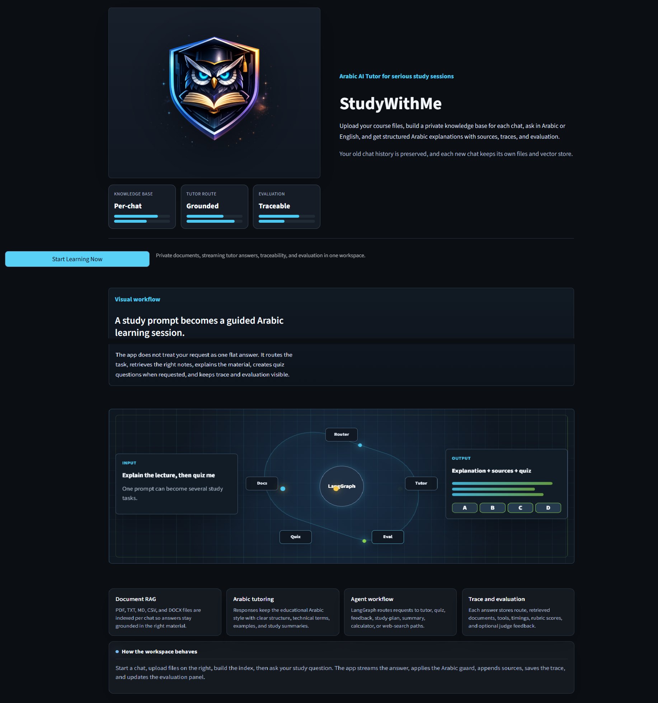
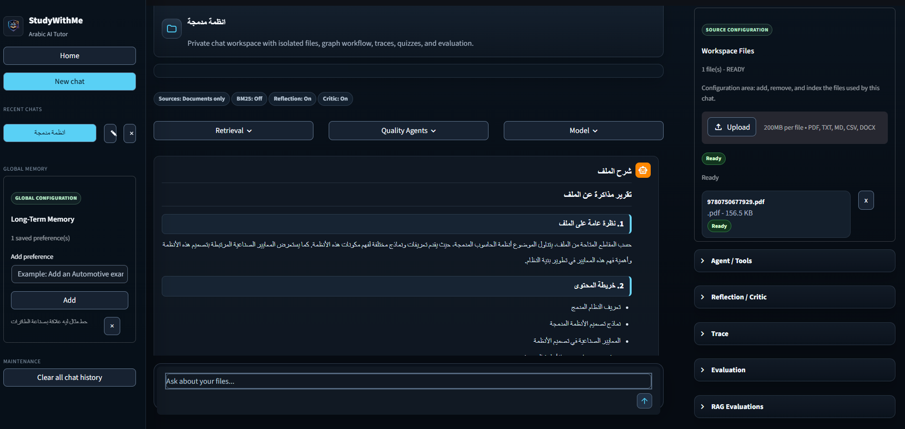
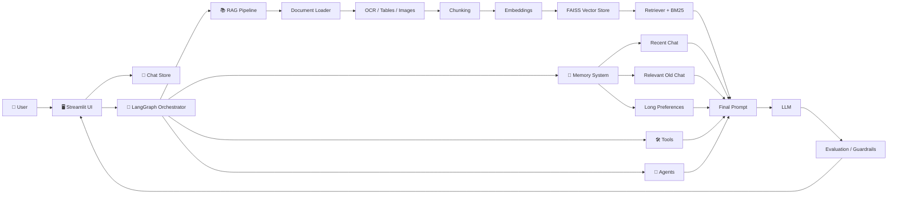
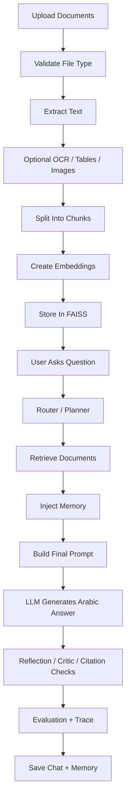
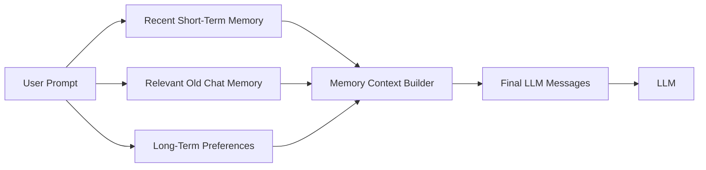
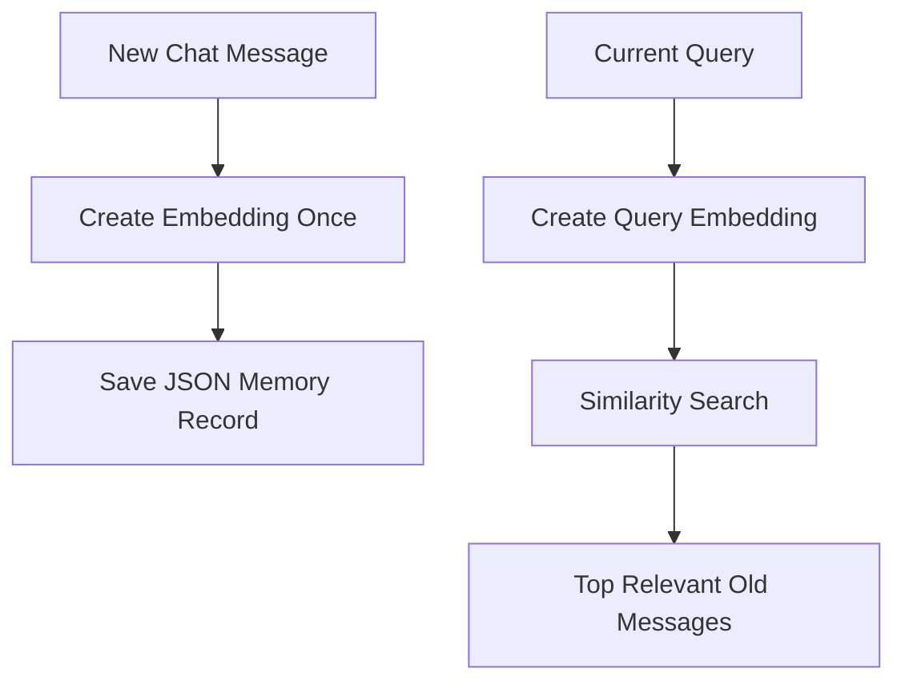
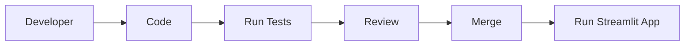

# StudyWithMe Arabic AI Tutor


**StudyWithMe** is an Arabic AI Tutor powered by RAG, memory, tool calling, and LangGraph workflows.
It helps students learn from uploaded documents through grounded explanations, quizzes, study plans,
chat memory, long-term preferences, and response evaluation.

The project is designed as a practical learning system for modern LLM engineering: retrieval,
embeddings, memory, agents, tools, tracing, and evaluation all working inside a friendly Streamlit app.

---

## Screenshots

| Screen | Preview |
| --- | --- |
| Home Page |  |
| Chat Workspace |  |

```text
assets/
|-- home_page.png
|-- chat_page.png
`-- logo.png
```

---

## Project Overview

Students often upload PDFs, lecture notes, or technical files and then struggle to turn them into a clear study path.
StudyWithMe solves that by combining:

- **Arabic-first tutoring** for comfortable explanations and study support.
- **RAG** so answers can be grounded in uploaded files instead of only model knowledge.
- **Memory** so follow-up questions like `لم أفهم` work naturally.
- **Tools and agents** for search, calculation, quizzes, feedback, reflection, critic checks, and evaluation.
- **Modern UI** built with Streamlit for chats, uploads, settings, memory, and runtime diagnostics.

Arabic support matters because learning is easier when explanations, summaries, and feedback are written in the student's natural study language.

---

## High-Level Architecture



### Block Guide

| Block | Responsibility |
| --- | --- |
| Streamlit UI | Chat workspace, sidebars, upload panel, controls, runtime status |
| Chat Store | Persistent JSON chats, messages, traces, evaluations |
| LangGraph Orchestrator | Routes each request through retrieval, tools, agents, evaluation, and final output |
| RAG Pipeline | Loads files, chunks text, embeds chunks, retrieves relevant context |
| Memory System | Injects recent chat, relevant previous chat, and user preferences |
| Tools | Calculator, document search, web search, quiz grading, citations, study utilities |
| Agents | Tutor, Summary, Quiz, Feedback, Study Plan, Web Search, Reflection, Critic |
| Evaluation | Deterministic checks plus optional RAGAS / DeepEval style evaluation |

---

## Current AI Pipeline



### Step-by-Step

1. **Upload**: The user uploads PDFs, text, Markdown, CSV, or DOCX files.
2. **Extract**: The app reads document text and can optionally process OCR, tables, and images.
3. **Chunk**: Long files are split into retrievable study chunks.
4. **Embed**: Chunks are embedded with a multilingual sentence-transformer model.
5. **Retrieve**: The app searches FAISS and can combine vector search with BM25.
6. **Plan**: LangGraph chooses the workflow: explain, summarize, quiz, feedback, study plan, web, or multi-task.
7. **Answer**: The LLM receives retrieved context, memory, tools, and instructions.
8. **Evaluate**: The response can be checked for Arabic output, citations, quality, and RAG faithfulness.
9. **Persist**: Chats, traces, evaluations, and memory are saved.

---

## Memory System



### Short Memory

Recent short-term memory sends the latest chat messages to the LLM. This supports natural follow-up questions:

```text
User: اشرح الملف
Assistant: ...
User: لم أفهم
```

The system uses the previous answer and previous file query instead of treating `لم أفهم` as a new isolated question.

### Relevant Chat Memory

Older chat messages are stored persistently and embedded once. When the user switches topics and returns later,
the app searches old memory semantically.



### Long-Term Preferences

Preferences are user-managed and persist across sessions.

Examples:

- `اشرح بالعربي`
- `استخدم أمثلة بسيطة`
- `أضف مثال Automotive في كل شرح`

---

## Folder Structure

```text
studywithme-arabic-ai/
├── app.py
├── requirements.txt
├── README.md
├── assets/
├── data/
│   ├── chats/
│   ├── raw_docs/
│   ├── evaluations/
│   └── memory/
├── docs/
├── eval/
├── notebooks/
├── report/
├── tests/
├── vector_store/
└── src/
    ├── agents/
    ├── chat/
    ├── config/
    ├── document_processing/
    ├── evaluation/
    ├── files/
    ├── graph/
    ├── guardrails/
    ├── llm/
    ├── memory/
    ├── prompts/
    ├── rag/
    ├── retrieval/
    ├── tools/
    ├── tracing/
    └── ui/
```

| Path | Purpose |
| --- | --- |
| `app.py` | Streamlit entrypoint |
| `src/ui/` | Home page, chat view, sidebars, upload panel, styling |
| `src/graph/` | LangGraph nodes, edges, schemas, orchestration |
| `src/agents/` | Tutor, summary, quiz, feedback, study plan, web, reflection, critic agents |
| `src/llm/` | LLM provider selection, model profiles, and streaming helpers |
| `src/prompts/` | Central prompt templates used by agents and graph nodes |
| `src/rag/` | RAG answer pipeline entrypoint |
| `src/retrieval/` | Document loading, chunking, embeddings, vector store, and BM25/vector retrieval |
| `src/guardrails/` | Arabic language guardrails and repair helpers |
| `src/config/` | Environment-driven application settings |
| `src/tools/` | Function tools for calculator, document search, web search, quiz grading, citations |
| `src/memory/` | Recent chat memory, relevant chat search, long-term preferences |
| `src/chat/` | Chat models, session state, persistent chat store |
| `src/files/` | File management, indexing jobs, and indexing status |
| `src/document_processing/` | OCR, table extraction, image extraction |
| `src/evaluation/` | Rubrics, deterministic evaluation, RAG evaluation service |
| `src/tracing/` | Trace models and trace persistence helpers |
| `data/` | Runtime data: chats, raw uploads, evaluations, memory |
| `vector_store/` | FAISS indexes and vector metadata |
| `tests/` | Workflow, router, RAG, evaluation, and tool tests |

---

## Installation Guide

### 1. Clone Repository

```bash
git clone <repository_url>
cd studywithme-arabic-ai
```

### 2. Create Virtual Environment

Windows:

```bash
python -m venv .venv
.venv\Scripts\activate
```

Linux / macOS:

```bash
python3 -m venv .venv
source .venv/bin/activate
```

### 3. Install Dependencies

```bash
pip install -r requirements.txt
```

### 4. Configure Environment

Create a `.env` file in the project root:

```env
OPENAI_API_KEY=your_openai_key_here
DEFAULT_MODEL_PROFILE=openai_gpt_4o_mini

EMBEDDING_MODEL_NAME=sentence-transformers/paraphrase-multilingual-MiniLM-L12-v2
CHUNK_SIZE=1000
CHUNK_OVERLAP=200
TOP_K=4

DEFAULT_BM25_SEARCH_ENABLED=false
WEB_SEARCH_ENABLED=false
OCR_ENABLED=false
TABLE_EXTRACTION_ENABLED=false
IMAGE_EXTRACTION_ENABLED=false

ENABLE_RAGAS_EVAL=false
ENABLE_DEEPEVAL_EVAL=false
LANGSMITH_TRACING_ENABLED=false
```

<details>
<summary><strong>Environment Variables</strong></summary>

| Variable | Default | Description |
| --- | --- | --- |
| `OPENAI_API_KEY` | empty | Required when using OpenAI models |
| `DEFAULT_MODEL_PROFILE` | `openai_gpt_4o_mini` | Default model profile shown in the app |
| `OPENAI_MODEL` | `gpt-4o-mini` | OpenAI model name |
| `OLLAMA_MODEL` | `qwen:7b` | Optional local model name |
| `LLM_REQUEST_TIMEOUT_SECONDS` | `180` | LLM request timeout |
| `EMBEDDING_MODEL_NAME` | multilingual MiniLM | Embedding model for RAG and memory |
| `CHUNK_SIZE` | `1000` | Document chunk size |
| `CHUNK_OVERLAP` | `200` | Overlap between chunks |
| `TOP_K` | `4` | Number of chunks retrieved by default |
| `DEFAULT_BM25_SEARCH_ENABLED` | `false` | Enable lexical BM25 beside vector retrieval |
| `WEB_SEARCH_ENABLED` | `false` | Enable web-search tooling |
| `OCR_ENABLED` | `false` | Enable OCR processing |
| `TABLE_EXTRACTION_ENABLED` | `false` | Enable table extraction |
| `IMAGE_EXTRACTION_ENABLED` | `false` | Enable image extraction |
| `ENABLE_RAGAS_EVAL` | `false` | Enable optional RAGAS evaluation |
| `ENABLE_DEEPEVAL_EVAL` | `false` | Enable optional DeepEval evaluation |
| `LANGSMITH_TRACING_ENABLED` | `false` | Enable LangSmith tracing |

</details>

### 5. Run Application

```bash
streamlit run app.py
```

Expected local URL:

```text
http://localhost:8501
```

---

## How To Use

### 1. Open The App

Run Streamlit and open the local URL.

### 2. Create A Chat

Use the left sidebar to create or switch conversations.

### 3. Upload Documents

Upload files such as PDF, TXT, Markdown, CSV, or DOCX.

### 4. Wait For Indexing

The app extracts text, chunks it, embeds it, and stores the vector index.

### 5. Ask Study Questions

Examples:

```text
اشرح الملف
اعمل 5 أسئلة MCQ من المحاضرة
لخص الفصل في نقط
لم أفهم، وضح أكثر
احسب 4*7
```

### 6. Use Long-Term Preferences

Add preferences such as:

```text
أضف مثال Automotive في كل شرح
استخدم أمثلة بسيطة
```

---

## Technologies Used

| Technology | Purpose |
| --- | --- |
| Python | Backend and orchestration |
| Streamlit | Web UI |
| LangChain | LLM, document, embedding, and RAG utilities |
| LangGraph | Stateful workflow graph |
| FAISS | Vector database |
| Sentence Transformers | Multilingual embeddings |
| OpenAI | Cloud LLM option |
| Ollama | Optional local LLM option |
| Pydantic | Structured schemas and validation |
| RAGAS / DeepEval | Optional RAG evaluation |
| Pandas / NumPy | Data handling |
| PyPDF / DOCX tools | Document loading |

---

## AI Concepts Used

| Concept | Status | Notes |
| --- | --- | --- |
| RAG | ✅ Implemented | File-grounded explanations and summaries |
| Embeddings | ✅ Implemented | Document chunks and chat memory |
| Vector Search | ✅ Implemented | FAISS-backed retrieval |
| BM25 Hybrid Search | ✅ Implemented | Optional lexical branch |
| OCR | ✅ Implemented | Optional document processing module |
| Table Extraction | ✅ Implemented | Optional document processing module |
| Chat Memory | ✅ Implemented | Recent + relevant old chat |
| Long-Term Preferences | ✅ Implemented | User-managed JSON preferences |
| Tool Calling | ✅ Implemented | Calculator, search, grading, citations, study tools |
| Planner / Router | ✅ Implemented | LangGraph planner node |
| Reflection Agent | ✅ Implemented | Optional quality pass |
| Critic Agent | ✅ Implemented | Optional risk and grounding pass |
| Multi-Task Workflow | ✅ Implemented | Explain + quiz and related combinations |
| RAG Evaluation | ✅ Implemented | Deterministic and optional external evaluation |
| Web Search | 🚧 Optional | Disabled unless configured |

---

## Agents And Tools

### Agents

| Agent | Role |
| --- | --- |
| Tutor Agent | Direct Arabic tutoring and explanation |
| Summary Agent | Study reports for uploaded files |
| Quiz Agent | Structured quiz generation |
| Feedback Agent | Review quiz answers and student responses |
| Study Plan Agent | Build revision plans |
| Web Search Agent | Answer with web context when enabled |
| Reflection Agent | Lightweight answer self-review |
| Critic Agent | Risk, grounding, and quality critique |

### Tools

| Tool | Role |
| --- | --- |
| Calculator | Arithmetic expressions |
| Document Search | Vector/BM25 retrieval from uploaded files |
| Web Search | External information retrieval when enabled |
| Quiz Grading | Score submitted quiz answers |
| Citation Checker | Check citation/source quality |
| Flashcard Generator | Study card creation |
| Concept Extractor | Extract important concepts |
| Study Progress | Analyze study progress and weak areas |

---

## Development Workflow



Recommended checks:

```bash
python -m pytest tests
python -m py_compile app.py
streamlit run app.py
```

For targeted workflow checks:

```bash
.venv\Scripts\python.exe tests\test_graph_workflow.py
```

---

## Roadmap

- [x] Streamlit chat UI
- [x] File upload and indexing
- [x] Basic RAG
- [x] FAISS vector store
- [x] BM25 hybrid retrieval
- [x] Arabic-first answer style
- [x] LangGraph workflow
- [x] Tool calling layer
- [x] Calculator tool
- [x] Quiz generation and grading
- [x] Recent chat memory
- [x] Relevant old chat memory
- [x] Long-term user preferences
- [x] Reflection and critic agents
- [x] RAG evaluation panel
- [ ] Add Docker setup
- [ ] Add CI pipeline
- [ ] Add deployment guide
- [ ] Add public demo video

---

## Contributing

Contributions are welcome. Keep changes focused and preserve existing behavior.

1. Fork the repository.
2. Create a feature branch.
3. Make a small, focused change.
4. Run relevant tests.
5. Open a pull request with a clear summary.

```bash
git checkout -b feature/my-improvement
git add .
git commit -m "Add my improvement"
git push origin feature/my-improvement
```

<details>
<summary><strong>Contribution Guidelines</strong></summary>

- Prefer small pull requests.
- Add tests for routing, memory, RAG, or evaluation changes.
- Do not commit runtime data from `data/` or `vector_store/`.
- Keep Arabic output quality in mind.
- Document new environment variables.
- Avoid changing unrelated UI or graph behavior in the same PR.

</details>

---

## License

License is currently **TBD**.

Before public release, add a license file such as:

- MIT
- Apache-2.0
- BSD-3-Clause

---

## Maintainer Notes

This project is both an AI tutor and an educational LLM engineering project.
It is intentionally useful as an application and readable as a learning codebase.

If you are studying RAG, LangGraph, memory, agents, or evaluation, start with:

```text
src/graph/app_graph.py
src/graph/nodes.py
src/memory/
src/tools/document_search_tool.py
src/ui/chat_view.py
```
